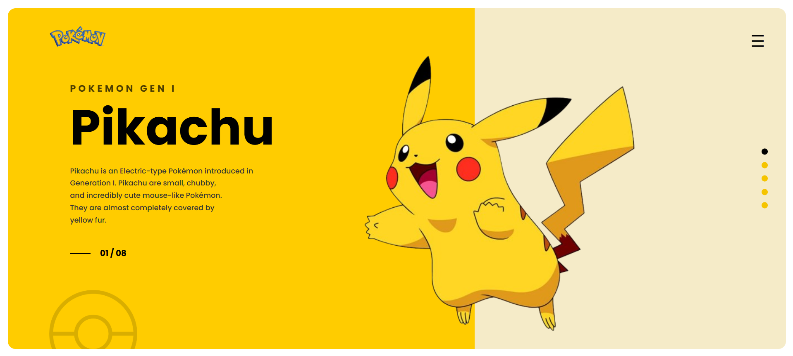

# 🎮 Easy Pokemon UI

A modern and responsive Pokémon themed landing page built using **HTML5** and **CSS3** as part of **Assignment 1** of Cohort 3.

---

## 📸 Preview



---

## 🌐 Live Demo

> *https://easy-pokemon-ui.netlify.app/*

---

## ✨ Features

- Clean and modern UI
- Responsive layout
- Semantic HTML5
- CSS Flexbox
- Custom typography
- Organized folder structure
- Optimized images

---

## 🛠️ Tech Stack

- HTML5
- CSS3

---

## 📂 Folder Structure

```text
Easy-Pokemon
│
├── assets
│   └── images
│       ├── pikachu_img.png
│       ├── pokeball.png
│       └── pokemon_logo.png
│
├── index.html
├── style.css
└── README.md
```

---

## 🚀 Getting Started

### Clone the repository

```bash
git clone https://github.com/Sunnycodes-tech/Cohort-3-Assignments.git
```

### Navigate to the project

```bash
cd A1-Assignment/Easy-Pokemon
```

### Open

Simply open **index.html** in your browser.

---

## 📚 What I Learned

During this project I practiced:

- Semantic HTML
- CSS Positioning
- Flexbox
- Image Handling
- Project Folder Structure
- Clean Code Organization

---

## 🎯 Assignment

**Cohort 3 — Assignment 1**

Difficulty Level:

- ✅ Easy

---

## 🚧 Future Improvements

- Improve responsiveness
- Add animations
- Better accessibility
- Dark mode
- Interactive components using JavaScript

---

## 👨‍💻 Author

**Sunny Singh**

GitHub: **Sunnycodes-tech**

---

⭐ If you like this project, consider giving the repository a star.
